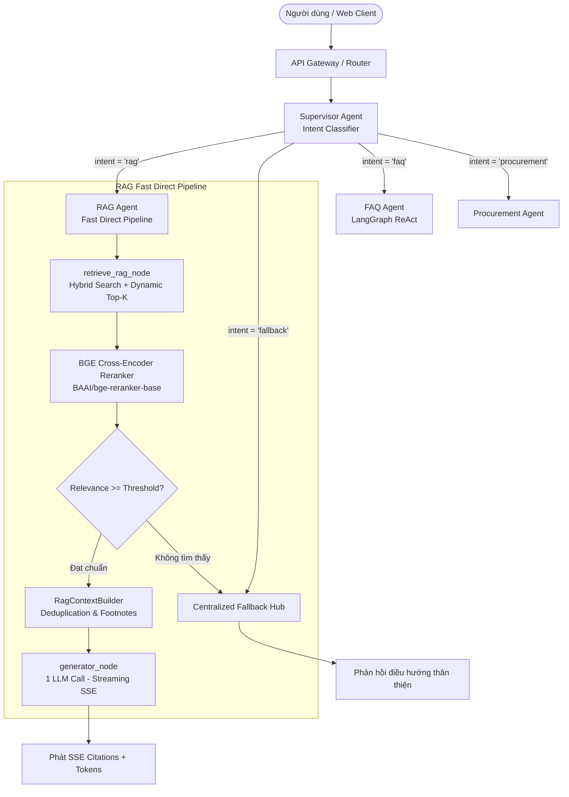

# Dev LLM Service - Enterprise Chatbot System

Dự án `dev_llm_service` là dịch vụ Backend AI Agent xử lý ngôn ngữ tự nhiên (LLM), RAG (Retrieval-Augmented Generation với Phân quyền RBAC & Citations), và đa đại lý (Multi-Agent System với LangGraph) thuộc hệ thống Enterprise Chatbot (BVBank).

---

## 📋 Mục Lục

1. [Kiến Trúc & Công Nghệ](#-kiến-trúc--công-nghệ)
2. [Cấu Trúc Thư Mục](#-cấu-trúc-thư-mục)
3. [Kiến Trúc RAG & Multi-Agent](#-kiến-trúc-rag--multi-agent)
    - [Fast Direct Pipeline (1 LLM Call)](#1-fast-direct-pipeline-1-llm-call)
    - [BGE Cross-Encoder Reranker](#2-bge-cross-encoder-reranker)
    - [Atomic Slide Aggregation & Token Chunker](#3-atomic-slide-aggregation--token-chunker)
    - [Quản Lý Prompt Tập Trung với Langfuse](#4-quản-lý-prompt-tập-trung-với-langfuse)
    - [Centralized Fallback Hub](#5-centralized-fallback-hub)
4. [Yêu Cầu Hệ Thống & Phần Cứng](#-yêu-cầu-hệ-thống--phần-cứng)
5. [Hướng Dẫn Cài Đặt](#-hướng-dẫn-cài-đặt)
6. [Cấu Hình Môi Trường (.env)](#-cấu-hình-môi-trường-env)
7. [Khởi Chạy Ứng Dụng](#-khởi-chạy-ứng-dụng)
8. [Các Script Tiện Ích (Scripts)](#-các-script-tiện-ích-scripts)
    - [Kiểm tra kết nối hệ thống (`check_connections.py`)](#1-kiểm-tra-kết-nối-toàn-bộ-hệ-thống-check_connectionspy)
    - [Nạp tài liệu tự động (`upload_documents.py`)](#2-nạp-tài-liệu-tự-động-hàng-loạt-upload_documentspy)
    - [Tái lập chỉ mục & Re-index tài liệu (`reindex_documents.py`)](#3-tái-lập-chỉ-mục--re-index-tài-liệu-reindex_documentspy)
    - [Chạy đánh giá Agent (`run_eval.py`)](#4-chạy-đánh-giá-agent-run_evalpy)
9. [Hướng Dẫn Nạp Tài Liệu (Document Ingest)](#-hướng-dẫn-nạp-tài-liệu-document-ingest)
10. [Hướng Dẫn Đánh Giá Agent (Evaluation)](#-hướng-dẫn-đánh-giá-agent-evaluation)
11. [Hướng Dẫn Phát Triển (Coding Guide)](#-hướng-dẫn-phát-triển-coding-guide)
12. [Kiểm Tra & Đảm Bảo Chất Lượng Code](#-kiểm-tra--đảm-bảo-chất-lượng-code)

---

## 🛠 Kiến Trúc & Công Nghệ

- **Ngôn ngữ lập trình:** Python >= 3.11
- **Trình quản lý gói:** [uv](https://github.com/astral-sh/uv) (Quản lý dependency & virtualenv hiệu năng cao)
- **Web Framework:** [FastAPI](https://fastapi.tiangolo.com/) + Uvicorn (Server-Sent Events SSE Streaming & Citations)
- **AI Agent Frameworks:** LangChain, LangGraph (StateGraph, Conditional Edges, Checkpointing), Google GenAI SDK (`google-genai`), vLLM / Ollama OpenAI-compatible API
- **Embedding & GPU Acceleration:** `SentenceTransformers` (`BAAI/bge-m3`, tự động nhận diện `cuda` / `cpu`), HuggingFace TEI (Text Embeddings Inference)
- **Reranker (Cross-Encoder):** `BAAI/bge-reranker-base` (SentenceTransformers CrossEncoder tính toán relevance score chuẩn xác cho Top-K kết quả từ Vector Search)
- **Database & Vector Search:** SQL Server 2025 (sử dụng pyodbc / ODBC Driver 18, Cosine Similarity Vector Search kết hợp DiskANN Indexing và RBAC Filtering)
- **Prompt Management & Tracing:** [Langfuse](https://langfuse.com/) (Quản lý prompt tập trung trên UI, TTL cache in-memory, Dynamic Prompt Hydration, Tracing & Latency Analytics) kết hợp LangSmith
- **Kiến trúc RAG:** Fast Direct Pipeline (1 LLM call, Inline Footnotes `[1]`, `[2]`, Clean Context Builder, Zero-Hallucination)
- **Code Quality & Typing:** Ruff, MyPy, Pytest, Coverage, TQDM, Rich UI

---

## 📂 Cấu Trúc Thư Mục

```text
dev_llm_service/
├── app/                        # Mã nguồn chính của ứng dụng
│   ├── ai/                     # Hệ thống AI Agents & RAG
│   │   ├── AI_ARCHITECTURE.md  # Tài liệu Kiến trúc & Hướng dẫn phát triển AI Subsystem
│   │   ├── agent/              # Định nghĩa các Agent hệ thống
│   │   │   ├── agentic_rag/    # RAG Agent (Fast Direct Pipeline)
│   │   │   │   ├── graph/      # StateGraph (retrieve_rag_node -> generator_node / fallback_node)
│   │   │   │   ├── nodes/      # retrieve_node.py, generator_node.py
│   │   │   │   ├── prompts/    # registry.py (Nạp prompt rag_generator từ Langfuse)
│   │   │   │   ├── state.py    # AgenticRAGState (user_query, context, citations, final_answer)
│   │   │   │   └── eval/       # Bộ test cases và benchmark cho RAG Agent
│   │   │   ├── faq/            # FAQ Agent (Tra cứu câu hỏi thường gặp)
│   │   │   │   ├── graph/      # StateGraph của FAQ
│   │   │   │   ├── nodes/      # faq_node.py (Nạp prompt faq_agent từ Langfuse)
│   │   │   │   ├── tools/      # search.py (Hybrid RRF Search trên CSDL FAQ)
│   │   │   │   ├── prompts/    # registry.py kết nối Langfuse
│   │   │   │   └── eval/       # Eval config & test cases cho FAQ
│   │   │   ├── fallback/       # Centralized Fallback Hub dùng chung
│   │   │   │   └── nodes/      # fallback_node.py (Phản hồi thân thiện khi out-of-scope / RAG miss)
│   │   │   ├── supervisor/     # Supervisor Agent phân loại ý định (Intent Classifier)
│   │   │   │   └── eval/       # 75 test cases đánh giá routing
│   │   │   └── procurement/    # Procurement Agent (Xử lý nghiệp vụ mua sắm)
│   │   ├── eval/               # Framework đánh giá dùng chung (Metrics, Scorer, Runner, Report)
│   │   └── rag/                # Pipeline nạp và truy xuất tri thức
│   │       ├── chunking/       # splitter.py (Token Chunker 800 tokens, Atomic Slide Aggregator)
│   │       ├── context/        # builder.py (RagContextBuilder làm sạch và định dạng ngữ cảnh)
│   │       ├── embedding/      # service.py (SentenceTransformer BGE-M3 / TEI / Ollama)
│   │       ├── ingestion/      # extractor.py (Trích xuất Word, PDF, Slide PPTX chuẩn xác)
│   │       └── retrieval/      # retriever.py (Vector Search + BGE Cross-Encoder Reranker)
│   ├── core/                   # Cấu hình cốt lõi (Config, Database, Exception, Logging, Middleware)
│   ├── llmops/                 # Quản lý LLM Provider Factory (Gemini, vLLM / Ollama, OpenAI)
│   ├── modules/                # Đóng gói logic theo nghiệp vụ Domain-Driven Design
│   │   ├── auth/               # Module Xác thực & Phân quyền
│   │   ├── chat/               # Module Chatbot & Lịch sử hội thoại (SSE Streaming + Citations)
│   │   ├── document/           # Module Ingest, Re-index & Quản lý tài liệu
│   │   ├── faq_knowledge/      # Module Quản lý CSDL FAQ & Nhập Excel
│   │   └── health/             # Module kiểm tra trạng thái dịch vụ (Health Check)
│   ├── routers/                # API Routers & Dependency Injection (App DI Container)
│   ├── lifespan.py             # Quản lý vòng đời ứng dụng FastAPI (Startup / Shutdown)
│   └── main.py                 # File khởi tạo ứng dụng FastAPI chính
├── data/
│   └── eval_results/           # Kết quả benchmark JSON (latest, history, benchmark_summary.json)
├── my_documents/               # Thư mục chứa tài liệu gốc nạp vào hệ thống
├── notebooks/                  # Jupyter notebooks thử nghiệm RAG, Prompt, Reranker, Routing
├── scripts/                    # Scripts tiện ích & tự động hóa
│   ├── check_connections.py    # Kiểm tra trạng thái kết nối Ollama, GPU, TEI & CSDL
│   ├── reindex_documents.py    # Tái lập chỉ mục tài liệu (Atomic Slide PPTX, Token Chunker DOCX)
│   ├── run_eval.py             # Script chạy đánh giá agent (eval) với Rich progress bar
│   ├── upload_documents.py     # Script nạp tài liệu tự động kèm Metadata + tqdm progress bar
│   └── format.sh / lint.sh     # Scripts kiểm tra & format code
├── .env                        # File biến môi trường (Local config)
├── pyproject.toml              # Khai báo dependency & cấu hình dự án
└── uv.lock                     # Lockfile phiên bản thư viện
```

---

## 🧠 Kiến Trúc RAG & Multi-Agent

Hệ thống RAG và Multi-Agent được thiết kế tối ưu hóa theo tiêu chuẩn Enterprise AI: **Độ trễ thấp (1.5 - 3.0s)**, **Không ảo giác (Zero-Hallucination)**, **Trích dẫn nguồn chuẩn học thuật (Inline Footnotes & Citations Table)** và **Bảo mật phân quyền dữ liệu (RBAC)**.



### 1. Fast Direct Pipeline (1 LLM Call)
- **Vấn đề của mô hình cũ:** Các mô hình ReAct 4-node hoặc Self-RAG với Grader / Hallucination Check tiêu tốn 3-4 cuộc gọi LLM liên tiếp, đẩy latency lên 10-15 giây, tiềm ẩn nguy cơ vòng lặp vô tận (infinite loop) và tiêu tốn token.
- **Giải pháp Fast Direct Pipeline:**
  - `retrieve_rag_node`: Thực thi Vector Search kết hợp phân quyền RBAC $\rightarrow$ BGE Cross-Encoder Reranking $\rightarrow$ Xây dựng Clean Context.
  - **Conditional Edge:** Nếu kho tài liệu có thông tin phù hợp $\rightarrow$ chuyển thẳng đến `generator_node`. Nếu không có hoặc dưới ngưỡng $\rightarrow$ chuyển sang `fallback_node`.
  - `generator_node`: Thực hiện duy nhất **1 cuộc gọi LLM** sinh câu trả lời hoàn chỉnh kèm chú thích trích dẫn `[1]`, `[2]` tương ứng với bảng tài liệu tham khảo cuối câu trả lời.
  - **Kết quả:** Giảm độ trễ từ ~12s xuống còn **~2s**, phản hồi tức thì và chính xác tuyệt đối theo tài liệu.

### 2. BGE Cross-Encoder Reranker
- Mô hình: `BAAI/bge-reranker-base` (chạy trực tiếp trên GPU CUDA hoặc CPU đa luồng).
- **Cơ chế:** Thay vì dựa vào LLM Grader tốn kém hoặc chỉ dùng Cosine Distance đơn thuần, Cross-Encoder phân tích đồng thời cặp `(Query, Chunk)` để tính điểm liên quan ngữ nghĩa chính xác (Logit Score).
- **Dynamic Top-K Selection:**
  - Nếu query dài hoặc phức tạp $\rightarrow$ Lấy Top 8 chunks.
  - Nếu query ngắn hoặc câu hỏi tra cứu định nghĩa $\rightarrow$ Lấy Top 4-5 chunks tinh hoa nhất.
  - Tự động gắn điểm số `score` trực tiếp vào Metadata của trích dẫn nguồn (`citations`).

### 3. Atomic Slide Aggregation & Token Chunker
- **Trích xuất Slide PPTX (Atomic Slide):**
  - Khắc phục triệt để lỗi cắt nhỏ slide vô nghĩa khiến mất ngữ cảnh biểu đồ, quy trình.
  - Mỗi slide PPTX được đóng gói thành **1 Chunk trọn vẹn** kèm tiêu đề nhận diện: `[Slide X/Y - Tiêu đề]`.
  - **Cơ chế Gộp Slide Kế Cận (Slide Aggregation):** Nếu slide $N$ có nội dung quá ngắn ($< 200$ ký tự - ví dụ slide tiêu đề mục, slide phân trang), hệ thống tự động gộp nội dung của nó vào slide $N+1$ kế tiếp.
- **Trích xuất Word (DOCX) & PDF:**
  - Sử dụng Token-based Recursive Chunker: `chunk_size = 800 tokens`, `chunk_overlap = 100 tokens`.
  - Cơ chế phòng vệ nhị phân: Loại bỏ 100% các ký tự rác hoặc binary zip từ file nén Word/Office, đảm bảo vector database chỉ chứa văn bản thuần túy và có nghĩa.

### 4. Quản Lý Prompt Tập Trung Với Langfuse
- Toàn bộ Prompt của các Agent (`rag_generator`, `faq_agent`) được quản lý tập trung trên giao diện UI của **Langfuse**.
- `app/ai/agent/agentic_rag/prompts/registry.py` nạp prompt từ Langfuse qua SDK, tự động cache in-memory với TTL 60s.
- Cho phép đội ngũ kỹ sư AI tinh chỉnh Prompt, cấu hình tham số nhiệt độ (`temperature`), ngữ điệu phản hồi trực tiếp mà **không cần khởi động lại dịch vụ hoặc build lại mã nguồn**.

### 5. Centralized Fallback Hub
- File: `app/ai/agent/fallback/nodes/fallback_node.py`
- Được thiết kế làm điểm tiếp nhận tập trung (Hub) cho các trường hợp:
  - Supervisor nhận diện câu hỏi nằm ngoài phạm vi nghiệp vụ ngân hàng BVBank / phần mềm gAMSPro.
  - RAG Agent không tìm thấy bất kỳ tài liệu liên quan nào trong CSDL có điểm phù hợp.
  - FAQ Agent tra cứu CSDL nhưng không có câu hỏi tương đương.
- Tự động điều hướng và đưa ra lời hướng dẫn thân thiện, gợi ý người dùng liên hệ kênh hỗ trợ chính thức (Hotline, email IT/HCQT).

---

## 💻 Yêu Cầu Hệ Thống & Phần Cứng

- **Hệ điều hành:** Windows 10/11, Ubuntu 22.04+, hoặc macOS
- **Python:** 3.11 trở lên
- **Trình quản lý gói:** `uv` (`pip install uv`)
- **Phần cứng (Khuyên dùng):** 
  - **GPU (CUDA):** Card đồ họa NVIDIA (vRAM >= 4GB) để tăng tốc Embedding với `BAAI/bge-m3` và suy luận LLM local.
  - **CPU Mode:** Tự động hỗ trợ chạy CPU hoàn toàn nếu máy không có GPU (không bị conflict hay lỗi).
- **Hệ quản trị CSDL:** SQL Server 2025 hoặc SQL Server hỗ trợ ODBC Driver 18 for SQL Server.

---

## 🚀 Hướng Dẫn Cài Đặt

### 1. Clone repository & chuyển vào thư mục dự án
```bash
cd dev_llm_service
```

### 2. Tự động khởi tạo môi trường ảo và cài đặt thư viện với `uv`
```bash
# Cài đặt tất cả phụ thuộc từ uv.lock
uv sync
```

---

## ⚙️ Cấu Hình Môi Trường (.env)

Tạo hoặc chỉnh sửa file `.env` tại thư mục gốc `dev_llm_service/`:

```ini
# --- Core Application ---
ENVIRONMENT=local
PROJECT_NAME="Chatbot BVBank AI Service"
BACKEND_CORS_ORIGINS=http://localhost,http://localhost:4200

# --- CSDL SQL Server ---
SQLSERVER_CONNECTIONSTRING="Server=LAPTOP-BE44K422\MSSQLSERVER01;Database=gAMSPro_BVB_AI_V1_LIVE_04082026_1;Trusted_Connection=yes;TrustServerCertificate=yes;"

# --- AI Provider Switch ---
# Lựa chọn: vllm | gemini | openai_compat
AI_PROVIDER=vllm

# --- Local / Ollama / vLLM API Config ---
LLM_MODEL=qwen3:1.7b
LLM_BASE_URL=http://localhost:11434/v1
LLM_TEMPERATURE=0.2
LLM_MAX_TOKENS=2048
LLM_API_KEY=EMPTY

# --- Embedding Config ---
# Model HuggingFace / PyTorch GPU: BAAI/bge-m3 | Ollama: bge-m3:latest
EMBEDDING_MODEL=bge-m3:latest
EMBEDDING_DIMS=1024
TEI_URL=http://localhost:8080

# --- Gemini API Config (Nếu dùng AI_PROVIDER=gemini) ---
GEMINI_API_KEY=YOUR_GEMINI_API_KEY
GEMINI_MODEL=gemini-3.5-flash-lite

# --- LangSmith Tracing ---
LANGCHAIN_TRACING_V2=true
LANGCHAIN_API_KEY=YOUR_LANGSMITH_API_KEY
LANGCHAIN_PROJECT=ai-agent-bvbank
LANGCHAIN_ENDPOINT=https://apac.api.smith.langchain.com
```

---

## ▶️ Khởi Chạy Ứng Dụng

### 1. Chạy trên môi trường Local Development (FastAPI + Uvicorn)

Chạy bằng `uv`:
```bash
uv run uvicorn app.main:app --reload --host 0.0.0.0 --port 8000
```

Hoặc kích hoạt Virtual Environment:
- **Windows (PowerShell):**
  ```powershell
  .venv\Scripts\activate
  uvicorn app.main:app --reload --port 8000
  ```
- **Linux/macOS:**
  ```bash
  source .venv/bin/activate
  uvicorn app.main:app --reload --port 8000
  ```

### 2. Chạy TEI Embedding Server bằng Docker GPU (Tùy chọn)
```bash
docker compose -f infra/docker/docker-compose.yml up -d
```

### 3. Kiểm tra Swagger UI / API Docs
- **Swagger UI:** `http://localhost:8000/docs`
- **ReDoc:** `http://localhost:8000/redoc`

---

## 🛠 Các Script Tiện Ích (Scripts)

### 1. Kiểm tra kết nối toàn bộ hệ thống (`check_connections.py`)
Kiểm tra Ollama Server, PyTorch GPU, TEI Server và CSDL SQL Server:
```bash
uv run python scripts/check_connections.py
```

### 2. Nạp tài liệu tự động hàng loạt (`upload_documents.py`)
Tự động đăng ký Metadata CSDL, tách chunk và Embedding GPU tài liệu từ thư mục `my_documents/` với thanh tiến trình `tqdm` 0% -> 100% cho từng file:
```bash
uv run python scripts/upload_documents.py
```

### 3. Tái lập chỉ mục & Re-index tài liệu (`reindex_documents.py`)
Script chuyên dụng để xử lý lại dữ liệu trong CSDL theo chuẩn Ingestion mới (Atomic Slide PPTX, Token Chunker 800 tokens Word/PDF, dọn rác nhị phân):

```bash
# Dọn sạch toàn bộ các chunk rác nhị phân (binary zip) khỏi CSDL
uv run python scripts/reindex_documents.py --clean-binary

# Re-index 1 tài liệu cụ thể theo ID trong CSDL
uv run python scripts/reindex_documents.py --id 1059

# Re-index toàn bộ các tài liệu Slide PPTX (áp dụng Atomic Slide Aggregator)
uv run python scripts/reindex_documents.py --type pptx

# Re-index toàn bộ các tài liệu Word DOCX (áp dụng Token Chunker 800 tokens)
uv run python scripts/reindex_documents.py --type docx

# Re-index toàn bộ kho tài liệu với kích thước batch tùy chỉnh
uv run python scripts/reindex_documents.py --all --batch-size 10
```

> **API Re-index:** Bạn cũng có thể kích hoạt re-index qua HTTP REST API:
> - `POST /api/v1/documents/reindex` (kèm body `{ "clean_binary_first": true, "doc_type": "pptx" }`)
> - `POST /api/v1/documents/{document_id}/reindex`

### 4. Chạy đánh giá Agent (`run_eval.py`)
Chạy bộ test đánh giá chất lượng agent (xem chi tiết ở phần [Hướng Dẫn Đánh Giá Agent](#-hướng-dẫn-đánh-giá-agent-evaluation)):
```bash
uv run python scripts/run_eval.py supervisor
```

---

## 📥 Hướng Dẫn Nạp Tài Liệu (Document Ingest)

Hệ thống RAG cần có tài liệu được nạp vào CSDL SQL Server (tách chunk + embedding vector) trước khi chatbot có thể trả lời câu hỏi. Dưới đây là hướng dẫn chi tiết quy trình nạp file tài liệu.

### Điều kiện tiên quyết

1. **Server đang chạy**: Ứng dụng FastAPI phải đang hoạt động tại `http://localhost:8000` (xem phần [Khởi Chạy Ứng Dụng](#-khởi-chạy-ứng-dụng)).
2. **CSDL kết nối thành công**: SQL Server đã được cấu hình đúng trong `.env` và server có thể kết nối được.
3. **Embedding Model sẵn sàng**: Ollama/TEI/GPU SentenceTransformer đã khởi động.

### Bước 1: Chuẩn bị file tài liệu

Copy các file tài liệu (`.docx`, `.pdf`, `.txt`, ...) vào thư mục `my_documents/` tại gốc dự án:

```text
dev_llm_service/
└── my_documents/
    ├── HDSD_gAMSPro_Giai_Doan_1.docx
    ├── HDSD_gAMSPro_Giai_Doan_2.pdf
    ├── QuyTrinh_MuaSam_TSCD.docx
    └── ...
```

> **Lưu ý:** Nếu thư mục `my_documents/` chưa tồn tại, script sẽ tự tạo và nhắc bạn copy file vào.

### Bước 2: Chạy Script nạp tài liệu

```bash
# Nạp tất cả file mới (tự động skip file đã có trong CSDL)
uv run python scripts/upload_documents.py

# Nạp lại toàn bộ (bỏ qua kiểm tra trùng, force re-upload)
uv run python scripts/upload_documents.py --force
```

### Quy trình xử lý từng file

Script `upload_documents.py` thực hiện tự động cho **mỗi file** trong `my_documents/`:

| Bước | Hành động | Mô tả |
|------|-----------|-------|
| 1 | **Kiểm tra CSDL** | Gọi API `GET /api/v1/documents` để lấy danh sách file đã nạp & tách chunk thành công → skip file trùng |
| 2 | **Đăng ký Metadata** | Gọi API `POST /api/v1/documents` với thông tin: tên tài liệu, tên file, dung lượng, category, access scope, allowed roles |
| 3 | **Upload & Embedding** | Gọi API `POST /api/v1/documents/upload` gửi binary file kèm metadata JSON → Server tự tách chunk & tạo embedding vector |
| 4 | **Hiển thị tiến trình** | Rich progress bar cho từng file: gửi byte → tách chunk & embedding GPU → hoàn tất (số chunks) |

### Ví dụ output khi chạy

```
╭─ 📦 Document Upload Pipeline ────────────────────╮
│    Folder: C:\...\my_documents                    │
│    Files : 5 (12.3 MB)  •  Skip: 2  •  New: 3    │
╰───────────────────────────────────────────────────╯

📤 Uploading 5 documents... ━━━━━━━━━━━━━━ 100%
  ⏭️  HDSD_Giai_Doan_1.docx         (45 chunks → Skip)
  ⏭️  HDSD_Giai_Doan_2.pdf          (38 chunks → Skip)
  ✅ QuyTrinh_MuaSam.docx           (27 chunks thành công)
  ✅ QuanLy_Kho_VatLieu.docx        (19 chunks thành công)
  ✅ BDS_KhaiThac_TruSo.pdf         (33 chunks thành công)

╭─ 🎉 HOÀN THÀNH ──────────────────────────────────╮
│    ✅ Mới nạp: 3   ⏭️ Bỏ qua: 2   📊 Tổng: 5   │
╰───────────────────────────────────────────────────╯
```

### Cấu hình mặc định khi nạp

| Tham số | Giá trị mặc định | Mô tả |
|---------|-------------------|-------|
| `category` | `"Quy trình nội bộ"` | Danh mục tài liệu |
| `access_scope` | `"Public"` | Phạm vi truy cập |
| `allowed_roles` | `["Public", "Employee"]` | Vai trò được phép xem |

> Có thể thay đổi giá trị mặc định trực tiếp trong `scripts/upload_documents.py` (các biến `DEFAULT_CATEGORY`, `DEFAULT_ACCESS_SCOPE`, `DEFAULT_ALLOWED_ROLES`).

---

## 📊 Hướng Dẫn Đánh Giá Agent (Evaluation)

Hệ thống Eval Framework cho phép đánh giá chất lượng từng agent một cách **tự động, có hệ thống**, sử dụng bộ test cases JSON và các metric cấu hình qua YAML. Kết quả được hiển thị trực quan bằng Rich UI và lưu trữ dưới dạng JSON để so sánh giữa các lần chạy.

### Kiến trúc Eval Framework

```text
┌─────────────────────────────────────────────────────────────────────┐
│  scripts/run_eval.py              ← Entrypoint: chạy eval từ CLI  │
│       │                                                             │
│       ▼                                                             │
│  app/ai/eval/runner.py            ← Đọc config.yaml + cases/*.json │
│       │                              Gọi agent thật, đo latency    │
│       ▼                                                             │
│  app/ai/eval/scorer.py            ← Chấm điểm 1 case bằng N metric│
│       │                                                             │
│       ▼                                                             │
│  app/ai/eval/metrics.py           ← Logic từng metric              │
│       │                              (ExactFieldMatch, MinValue,    │
│       │                               Latency, LLMJudge)           │
│       ▼                                                             │
│  app/ai/eval/report.py            ← In Rich UI + lưu JSON          │
└─────────────────────────────────────────────────────────────────────┘

┌─────────────────────────────────────────────────────────────────────┐
│  app/ai/agent/<agent>/eval/       ← Mỗi agent tự khai báo:        │
│       ├── config.yaml             ←   Dùng metric nào, threshold?  │
│       └── cases/*.json            ←   Dữ liệu test (input/expect) │
└─────────────────────────────────────────────────────────────────────┘
```

> **Nguyên tắc:** Logic chấm điểm (`app/ai/eval/`) là **dùng chung** — sửa 1 chỗ, tất cả agent đều áp dụng. Agent chỉ cần khai báo **"dùng metric nào"** qua `config.yaml` và cung cấp **test cases** qua file JSON.

### Chạy Eval

Hệ thống hỗ trợ chạy bằng lệnh `python scripts/run_eval.py` hoặc sử dụng shortcut ngắn gọn `uv run poe eval`:

#### Đánh giá 1 agent cụ thể

```bash
# Đánh giá Supervisor Agent (Toàn bộ 75 test cases)
uv run poe eval supervisor

# Chỉ chạy lại các test case bị FAIL ở lần chạy trước đó (bỏ qua các case đã PASS)
uv run poe eval supervisor --failed
# Hoặc viết tắt:
uv run poe eval supervisor -f

# Đánh giá 1 test case cụ thể theo index (ví dụ: index 31 hoặc ID TC_031)
uv run poe eval supervisor 31

# Đánh giá FAQ Agent
uv run poe eval faq
```

#### Đánh giá tất cả agent

```bash
uv run poe eval --all
```

> **Lưu ý:** Eval gọi **agent thật** (không mock) — cần đảm bảo LLM server (Ollama/vLLM) đang chạy trước khi thực hiện.

### Cấu trúc file Test Cases (JSON)

Mỗi agent có thư mục `eval/cases/` chứa file `.json`. Mỗi file là 1 mảng JSON các test case:

```json
[
    {
        "index": 1,
        "id": "TC_001_faq_hotline_gamspro",
        "input": {
            "user_query": "Số điện thoại hotline hỗ trợ kỹ thuật phần mềm gAMSPro là gì?"
        },
        "expected": {
            "target_agent": "faq"
        },
        "tags": ["tc_001", "faq", "easy"]
    }
]
```

| Trường | Bắt buộc | Mô tả |
|--------|----------|-------|
| `id` | ✅ | Mã định danh duy nhất cho test case |
| `input` | ✅ | Payload truyền vào agent (vd `{"user_query": "..."}`) |
| `expected` | ✅ | Giá trị kỳ vọng, khớp field với metric trong `config.yaml` |
| `index` | ❌ | Số thứ tự (dùng để sắp xếp hiển thị) |
| `tags` | ❌ | Nhãn phân loại (`easy`, `medium`, `hard`, `adversarial`...) |

#### Thêm test case mới

Để thêm test case, chỉ cần **thêm phần tử mới vào mảng JSON** trong file `cases/*.json` hiện có, hoặc tạo file `.json` mới trong cùng thư mục `cases/`. Runner tự động quét tất cả file `*.json` trong thư mục.

### Cấu hình Metric (`config.yaml`)

Mỗi agent khai báo các tiêu chí đánh giá trong file `eval/config.yaml`:

#### Ví dụ: Supervisor Agent (routing — đúng/sai tuyệt đối)

```yaml
# app/ai/agent/supervisor/eval/config.yaml
metrics:
  - type: exact_field_match     # So khớp chính xác field output
    params:
      field: target_agent       # Kiểm tra agent được route có đúng không

  - type: min_value             # Kiểm tra giá trị số >= ngưỡng
    params:
      field: confidence
      min_value: 0.5

  - type: latency               # Kiểm tra thời gian phản hồi
    params:
      max_seconds: 20.0
```

#### Ví dụ: FAQ Agent (trả lời văn bản — chấm bằng LLM Judge)

```yaml
# app/ai/agent/faq/eval/config.yaml
metrics:
  - type: llm_judge             # Dùng LLM (Gemini) làm giám khảo chấm điểm
    params:
      criterion: relevance      # Tiêu chí: relevance / faithfulness
      min_score: 0.7

  - type: latency
    params:
      max_seconds: 5.0
```

### Các Metric hỗ trợ

| Metric | Type trong YAML | Mô tả | Params |
|--------|-----------------|-------|--------|
| **Exact Field Match** | `exact_field_match` | So khớp chính xác 1 field output với expected. Dùng cho routing, classification | `field` (tên field cần so) |
| **Min Value** | `min_value` | Kiểm tra 1 field số (vd confidence) >= ngưỡng tối thiểu | `field`, `min_value` |
| **Latency** | `latency` | Kiểm tra thời gian chạy agent không vượt ngưỡng (giây) | `max_seconds` |
| **LLM Judge** | `llm_judge` | Dùng LLM (mặc định Gemini API) làm giám khảo chấm relevance/faithfulness từ 0.0–1.0 | `criterion`, `min_score`, `judge_provider` (mặc định `gemini`), `judge_model` |

> **Thêm metric mới:** Tạo class kế thừa `Metric` trong `app/ai/eval/metrics.py`, rồi đăng ký vào `_METRIC_REGISTRY` trong `app/ai/eval/runner.py`.

### Đọc hiểu kết quả Eval

Khi chạy eval, kết quả được hiển thị với Rich UI trực tiếp trên terminal:

```
╭─ ⚡ Evaluating Agent: supervisor ─╮
│                                    │
╰────────────────────────────────────╯

Running 50 test cases... ━━━━━━━━━━━━━━━━━ 100%  00:45

  [01/50] ✓ PASS TC_001_faq_hotline_gamspro      (conf: 0.95) (0.82s)
  [02/50] ✓ PASS TC_002_faq_link_app_ios          (conf: 0.91) (0.75s)
  ...
  [46/50] ✗ FAIL TC_046_fallback_mo_ho_duyet_phieu (conf: 0.40) (1.20s)
  ...

╭─ 🏆 Agent: supervisor  │  Pass: 47/50  │  Avg Score: 0.94 ─╮
╰─────────────────────────────────────────────────────────────╯
  Pass Rate: ████████████████████░░ 94%

┌──────────┬──────────────────────────────┬───────┬─────────────────────┐
│  Status  │ Test Case                    │ Score │ Metrics             │
├──────────┼──────────────────────────────┼───────┼─────────────────────┤
│  ✓ PASS  │ TC_001_faq_hotline_gamspro   │  1.00 │ ● exact_match 1.00  │
│  ✗ FAIL  │ TC_046_fallback_mo_ho...     │  0.33 │ ○ exact_match 0.00  │
└──────────┴──────────────────────────────┴───────┴─────────────────────┘

╭─ ❌ Failed Details ──────────────────────────────────────────────────╮
│  ✗ TC_046_fallback_mo_ho_duyet_phieu                                │
│      └─ exact_match:target_agent: expected='fallback' actual='faq'  │
╰──────────────────────────────────────────────────────────────────────╯
```

### Kết quả JSON (`data/eval_results/`)

Sau mỗi lần chạy, kết quả được lưu tự động theo cấu trúc chuẩn Enterprise LLMOps tại thư mục `data/eval_results/`:

```text
dev_llm_service/
└── data/
    └── eval_results/
        ├── benchmark_summary.json                      # Bảng tổng hợp Benchmark Dashboard tất cả Agent
        ├── latest/                                      # File kết quả mới nhất (dùng cho CI/CD pipeline)
        │   ├── supervisor_latest.json
        │   └── faq_latest.json
        └── history/                                     # Lịch sử chi tiết theo mốc thời gian (Audit & Regression tracking)
            ├── supervisor/
            │   ├── 2026-08-09_22-43-04_supervisor_pass58%.json
            │   └── 2026-08-09_22-55-12_supervisor_pass100%.json
            └── faq/
                └── 2026-08-09_22-50-00_faq_pass95%.json
```

File JSON bổ sung **Rich Metadata chuẩn Enterprise** (`timestamp_utc`, `environment`, `llm_provider`, `llm_model`, `execution_time_seconds`) cùng thông số tổng quan `summary` và thông tin chi tiết từng test case. Dùng để:
- **Theo dõi hồi biến (Regression Tracking):** Đánh giá chính xác sự khác biệt trước và sau khi đổi Prompt/Model qua lịch sử `history/`.
- **Tích hợp CI/CD Fast Pass:** CI/CD dễ dàng đọc file `latest/<agent>_latest.json` hoặc `benchmark_summary.json`.

### Thêm Eval cho Agent mới

Để thêm bộ đánh giá cho 1 agent mới (ví dụ: `agentic_rag`):

**Bước 1:** Tạo thư mục eval trong agent:
```text
app/ai/agent/<tên_agent>/eval/
├── config.yaml
└── cases/
    └── <tên_bộ_test>.json
```

**Bước 2:** Viết `config.yaml` khai báo metric phù hợp (xem [Các Metric hỗ trợ](#các-metric-hỗ-trợ)).

**Bước 3:** Viết test cases JSON theo format (xem [Cấu trúc file Test Cases](#cấu-trúc-file-test-cases-json)).

**Bước 4:** Đăng ký entrypoint trong `scripts/run_eval.py`:

```python
# Thêm hàm async nhận dict input -> dict output
async def _agentic_rag_entrypoint(input_: dict[str, Any]) -> dict[str, Any]:
    from app.ai.agent.agentic_rag import agentic_rag_graph
    result = await agentic_rag_graph.ainvoke({
        "user_query": input_["user_query"],
        "user_roles": input_.get("user_roles", ["Public", "Employee"]),
    })
    return {"final_answer": result.get("final_answer", "")}

# Đăng ký vào registry
_AGENT_ENTRYPOINTS: dict[str, ...] = {
    "supervisor": _supervisor_entrypoint,
    "faq": _faq_entrypoint,
    "agentic_rag": _agentic_rag_entrypoint,   # ← Thêm dòng này
}
```

**Bước 5:** Chạy eval:
```bash
uv run python scripts/run_eval.py agentic_rag
```

---

## 🏗 Hướng Dẫn Phát Triển (Coding Guide)

### 1. Thêm LLM Provider Mới
Tất cả các mô hình LLM được trừu tượng hóa thông qua Factory trong `app/llmops/factory.py`. Bạn chỉ cần thêm provider mới (ví dụ: Azure OpenAI, Anthropic) bằng cách triển khai hàm khởi tạo tương ứng và đăng ký vào Factory.

### 2. Mô hình Embedding (GPU / CPU Dual Mode)
Trong `app/ai/rag/embedding/service.py`:
- **Ưu tiên 1:** Tự động chạy `SentenceTransformer("BAAI/bge-m3", device="cuda")` nếu máy có GPU CUDA, hoặc `device="cpu"` nếu máy dùng CPU.
- **Ưu tiên 2:** TEI HTTP Server (`http://localhost:8080`).
- **Ưu tiên 3:** Ollama / vLLM Embeddings API (`/v1/embeddings`).

### 3. Tách Citations trong RAG Chat Stream
Khi gọi `/api/v1/chat/stream`, Backend phát sự kiện `event: citations` chứa danh sách trích dẫn nguồn (`source`, `page`, `chunk_id`, `score`) độc lập trước sự kiện stream token `event: token`. Điều này giúp Frontend Angular có thể render ngay Header hoặc Drawer tài liệu nguồn trong khi LLM vẫn đang stream từng token câu trả lời.

### 4. Quản Lý Prompt Với Langfuse Prompt Registry
Mọi Agent mới nên đăng ký prompt qua Langfuse Registry (`app/ai/agent/<agent>/prompts/registry.py`):
```python
from langfuse import Langfuse

# Khởi tạo client Langfuse
client = Langfuse()

# Lấy prompt có quản lý phiên bản và TTL caching
prompt_obj = client.get_prompt("my_new_agent_prompt", cache_ttl_seconds=60)
compiled_prompt = prompt_obj.compile(user_query=query, context=context)
```
Không nạp file prompt local tĩnh để đảm bảo khả năng A/B testing và cập nhật prompt tức thì từ Langfuse UI mà không cần redeploy code.

---

## 🧪 Kiểm Tra & Đảm Bảo Chất Lượng Code

- **Định dạng code:**
  ```bash
  uv run ruff format app scripts
  ```
- **Linter & Type Check:**
  ```bash
  uv run ruff check app scripts
  uv run mypy app
  ```
- **Chạy Tests:**
  ```bash
  uv run pytest
  ```
