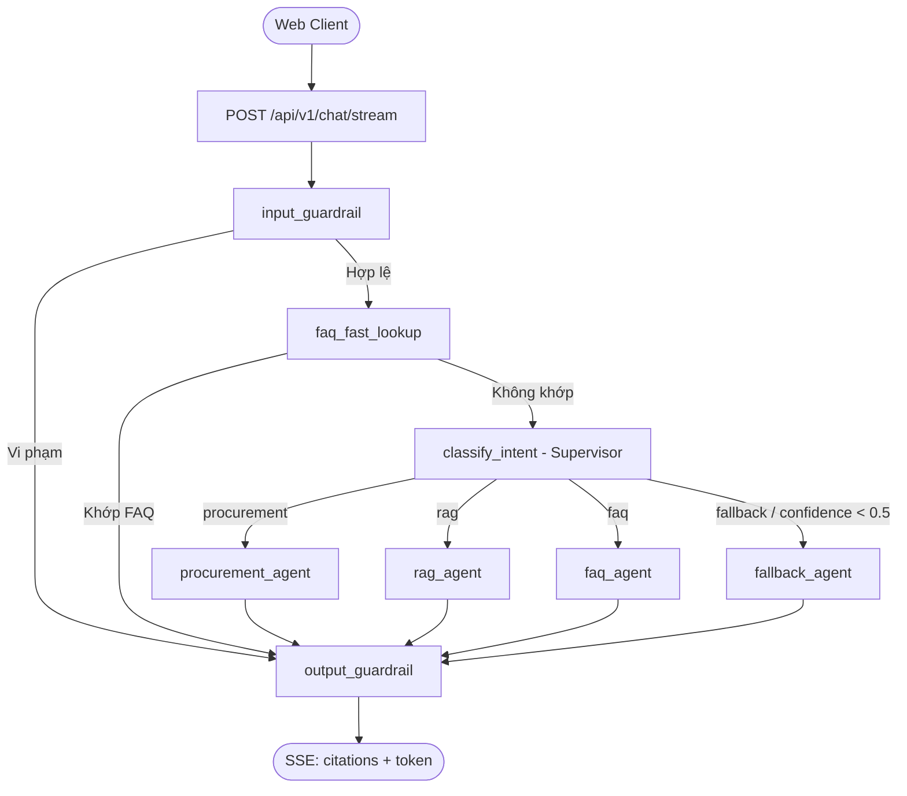

# Dev LLM Service - GSOFT AI Service Platform

Nền tảng backend AI dùng chung của GSOFT: một FastAPI service cung cấp mọi năng lực AI (AI Agent, RAG, OCR, Speech-to-Text, RPA, ...) qua REST API `/api/v1`. gAMSPro (.NET gateway), Angular frontend hay bất kỳ hệ thống nào khác chỉ cần gọi HTTP, không phải tự tích hợp LLM.

Các service dùng chung một nền tảng: provider factory cho LLM, embedding, cấu hình tập trung, SQL Server, Langfuse (prompt + tracing), guardrail, eval framework. Thêm một service AI mới là thêm một module, không dựng lại hạ tầng.

---

## 🧩 Các Service AI

| Service | Trạng thái | Vị trí | API |
|---|---|---|---|
| **AI Agent / Chatbot** (Multi-Agent: Supervisor, RAG, FAQ, Procurement, Fallback) | ✅ Đang chạy | `app/ai/orchestration/`, `app/ai/agent/` | `/chat/stream` |
| **RAG & Quản lý tri thức** (ingest, chunk, embedding, hybrid search, RBAC, citations) | ✅ Đang chạy | `app/ai/rag/`, `app/modules/document/` | `/documents` |
| **FAQ Knowledge Base** | ✅ Đang chạy | `app/modules/faq_knowledge/` | `/faq` |
| **Speech-to-Text** (Gemini) | ✅ Đang chạy | `app/modules/chat/transcribe_service.py` | `/chat/transcribe` |
| **OCR** (tài liệu scan, hóa đơn, hợp đồng) | 🟡 Mới có config (`INGESTION_ENABLE_OCR`, `INGESTION_ENABLE_VISION_OCR`), notebook thử nghiệm Gemini / PaddleOCR trong `notebooks/2_OCR-*` | dự kiến `app/ai/ocr/`, `app/modules/ocr/` | dự kiến `/ocr` |
| **RPA** (tự động thao tác trên hệ thống nghiệp vụ) | ⚪ Chưa triển khai | dự kiến `app/ai/rpa/`, `app/modules/rpa/` | dự kiến `/rpa` |

Hướng dẫn thêm service mới xem [Thêm Service AI Mới](#-thêm-service-ai-mới).

---

## 🛠 Công Nghệ

- **Python** 3.11–3.12, quản lý gói bằng [uv](https://github.com/astral-sh/uv)
- **FastAPI** + Uvicorn (SSE streaming)
- **LangChain / LangGraph**. LLM qua `langchain-google-genai` (Gemini) hoặc OpenAI-compatible API (vLLM / Ollama / llama.cpp, chỉ gọi HTTP)
- **Embedding:** `BAAI/bge-m3` (1024 chiều) qua TEI hoặc OpenAI-compatible `/v1/embeddings`
- **Reranker:** `bge` (CrossEncoder `BAAI/bge-reranker-base`), `llamacpp` (HTTP), `flashrank`, hoặc `disabled`
- **CSDL:** SQL Server 2025 (pyodbc, ODBC Driver 18), Vector Search + Full-Text Search kết hợp RRF
- **Ingestion:** `markitdown`, `python-docx`, `pypdf`, `python-pptx`, `openpyxl`, `underthesea`
- **Prompt & Tracing:** [Langfuse](https://langfuse.com/). LangSmith bị tắt cứng trong `app/core/config.py`
- **Code quality:** Ruff, MyPy, `ty`, Pytest

---

## 📂 Cấu Trúc Thư Mục

```text
dev_llm_service/
├── app/
│   ├── ai/                     # Logic AI, mỗi năng lực một thư mục (ocr/, rpa/ thêm vào đây)
│   │   ├── AI_ARCHITECTURE.md  # Tài liệu kiến trúc AI subsystem
│   │   ├── orchestration/      # Orchestrator graph: guardrail → FAQ fast-lookup → supervisor → agent
│   │   ├── guardrails/         # Input / Output guardrail
│   │   ├── agent/
│   │   │   ├── supervisor/     # Phân loại ý định (procurement | rag | faq | fallback)
│   │   │   ├── agentic_rag/    # RAG agent: retrieve_node → generator_node (1 LLM call)
│   │   │   ├── faq/            # FAQ agent
│   │   │   ├── procurement/    # Nghiệp vụ mua sắm gAMSPro (router → agent → responder, gọi .NET backend)
│   │   │   └── fallback/       # Phản hồi khi ngoài phạm vi / không tìm thấy
│   │   ├── eval/               # Eval framework dùng chung (metrics, scorer, runner, report)
│   │   └── rag/
│   │       ├── ingestion/      # Trích xuất Word/PDF/PPTX
│   │       ├── chunking/       # Token chunker, atomic slide aggregator
│   │       ├── text/           # Chuẩn hóa tiếng Việt, từ viết tắt ngân hàng
│   │       ├── embedding/      # Embedding service
│   │       ├── retrieval/      # Hybrid search + query analyzer (dynamic top-k)
│   │       ├── reranker/       # Các reranker + factory theo RERANKER_TYPE
│   │       └── context/        # RagContextBuilder
│   ├── core/                   # Config, database, logging, middleware, security, user context
│   ├── llmops/                 # LLM provider factory, Langfuse client
│   ├── modules/                # API theo nghiệp vụ: chat, document, faq_knowledge, health (mỗi service một module)
│   ├── routers/                # API router /api/v1 + DI
│   ├── lifespan.py             # Startup: tạo bảng Documents/FaqVectors, FTS index, job dọn hội thoại cũ
│   └── main.py
├── infra/docker/               # docker-compose TEI (GPU)
├── notebooks/                  # Notebook thử nghiệm
├── scripts/                    # Script tiện ích (xem bên dưới)
├── tests/
├── .env.example
└── pyproject.toml
```

`data/` (kết quả eval) và `my_documents/` (tài liệu cần nạp) nằm trong `.gitignore`, tạo local khi cần.

---

## 🧠 AI Agent: Luồng Xử Lý


```mermaid
graph TD
    User([Web Client]) --> Stream[POST /api/v1/chat/stream]
    Stream --> InG[input_guardrail]
    InG -->|Vi phạm| OutG[output_guardrail]
    InG -->|Hợp lệ| FastFAQ[faq_fast_lookup]
    FastFAQ -->|Khớp FAQ| OutG
    FastFAQ -->|Không khớp| Sup[classify_intent - Supervisor]
    Sup -->|procurement| Proc[procurement_agent]
    Sup -->|rag| RAG[rag_agent]
    Sup -->|faq| FAQ[faq_agent]
    Sup -->|fallback / confidence < 0.5| FB[fallback_agent]
    Proc --> OutG
    RAG --> OutG
    FAQ --> OutG
    FB --> OutG
    OutG --> End([SSE: citations + token])
```

- **FAQ fast-lookup:** khớp FAQ (ngưỡng `FAQ_FAST_MATCH_THRESHOLD`) thì trả lời luôn, không gọi LLM.
- **RAG agent:** hybrid search (Vector + FTS, RRF) có lọc RBAC → rerank → lọc theo `RERANKER_SCORE_THRESHOLD` → 1 lần gọi LLM sinh câu trả lời kèm chú thích `[1]`, `[2]`. Không đủ tài liệu thì chuyển sang fallback.
- **Chunking:** DOCX/PDF chia theo token (`RAG_CHUNK_SIZE=800`, overlap 100). PPTX mỗi slide là 1 chunk, slide ngắn hơn `RAG_MIN_SLIDE_CHARS` được gộp vào slide kế tiếp.
- **Prompt:** các agent nạp prompt từ Langfuse (`app/ai/agent/<agent>/prompts/registry.py`). Sửa prompt trên Langfuse UI, không cần deploy lại.
- **SSE events:** `chat_started` → `citations` → `token` (nhiều lần) → `chat_ended`.

---

## 🚀 Cài Đặt & Chạy

```bash
cd dev_llm_service
uv sync
cp .env.example .env   # rồi điền giá trị thật
```

`app/core/config.py` là nguồn chân lý cho mọi biến cấu hình. `.env.example` liệt kê đầy đủ theo config đó. Các biến chính:

| Nhóm | Biến |
|---|---|
| CSDL | `SQLSERVER_CONNECTIONSTRING` |
| LLM | `AI_PROVIDER` (`vllm` \| `gemini` \| `openai_compat`), `FALLBACK_AI_PROVIDER`, `LLM_MODEL`, `LLM_BASE_URL`, `GEMINI_API_KEY` |
| Embedding | `TEI_URL`, `EMBEDDING_MODEL`, `ENABLE_LOCAL_EMBEDDING_FALLBACK` |
| Reranker | `RERANKER_TYPE`, `RERANKER_URL`, `RERANKER_MODEL`, `RERANKER_SCORE_THRESHOLD` |
| Search | `FTS_ENABLED`, `RRF_VECTOR_WEIGHT`, `RRF_FTS_WEIGHT` |
| Langfuse | `LANGFUSE_ENABLED`, `LANGFUSE_PUBLIC_KEY`, `LANGFUSE_SECRET_KEY`, `LANGFUSE_HOST` |
| gAMSPro | `NET_BACKEND_URL` (backend .NET cho procurement agent) |
| Bảo mật | `REQUIRED_API_KEY` (rỗng = tắt, chỉ dùng khi dev) |

Chạy server:

```bash
uv run poe dev
# hoặc: uv run uvicorn app.main:app --reload --port 8000
```

- Swagger: `http://localhost:8000/docs`
- TEI embedding GPU (tùy chọn): `docker compose -f infra/docker/docker-compose.yml up -d`

Embedding thử lần lượt: TEI (`TEI_URL`) → OpenAI-compatible `/v1/embeddings` → SentenceTransformer local (chỉ khi `ENABLE_LOCAL_EMBEDDING_FALLBACK=True`).

---

## 🔌 API Chính (`/api/v1`)

| Prefix | Chức năng |
|---|---|
| `/health` | Health check |
| `/chat` | `stream` (SSE), `conversations` (CRUD), `feedback`, `transcribe` (speech-to-text qua Gemini) |
| `/documents` | CRUD metadata, `upload`, `upload-status/{task_id}`, `search`, `reindex` |
| `/faq` | CRUD FAQ, `upload-excel`, `sync-vectors` |

---

## 🛠 Scripts

| Lệnh | Chức năng |
|---|---|
| `uv run python scripts/check_connections.py` | Kiểm tra SQL Server, FastAPI, LLM, embedding server |
| `uv run poe upload` (`--force` để nạp lại) | Nạp mọi file trong `my_documents/` qua API (server phải đang chạy) |
| `uv run python scripts/reindex_documents.py --id <ID> \| --type pptx \| --all \| --clean-binary` | Chunk + embedding lại tài liệu trong CSDL |
| `uv run python scripts/sync_document_rbac_metadata.py` | Đồng bộ quyền từ `RagDocuments`/`RagDocumentRoles` xuống chunk trong `Documents` |
| `uv run python scripts/push_evaluator_intent.py` | Đẩy eval cases lên Langfuse dataset |
| `uv run python scripts/run_experiment.py` | Chạy experiment trên Langfuse dataset |
| `uv run python scripts/export_data.py` | Xuất scores Langfuse ra `data/langfuse/scores_export.csv` |

Mặc định khi nạp tài liệu (`DEFAULT_CATEGORY`, `DEFAULT_ACCESS_SCOPE`, `DEFAULT_ALLOWED_ROLES`) sửa trực tiếp trong `scripts/upload_documents.py`.

---

## 📊 Đánh Giá Agent (Eval)

```bash
uv run poe eval supervisor        # 1 agent: supervisor | faq | procurement (gamspro) | rag (agentic_rag)
uv run poe eval supervisor 31     # 1 test case theo index hoặc ID
uv run poe eval supervisor -f     # chỉ chạy lại case FAIL lần trước
uv run poe eval supervisor -t 0.8 # ngưỡng pass rate (mặc định 0.90)
uv run poe eval --all
```

Eval gọi agent thật (không mock), cần LLM server đang chạy. Kết quả lưu ở `data/eval_results/` (`latest/`, `history/`, `benchmark_summary.json`).

Mỗi agent tự khai báo trong `app/ai/agent/<agent>/eval/`:

```text
eval/
├── config.yaml     # metric + ngưỡng
└── cases/*.json    # [{ "id", "input": {...}, "expected": {...}, "index"?, "tags"? }]
```

Ví dụ `config.yaml`:

```yaml
metrics:
  - type: exact_field_match
    params: { field: target_agent }
  - type: min_value
    params: { field: confidence, min_value: 0.5 }
  - type: latency
    params: { max_seconds: 20.0 }
```

| Metric | Params |
|---|---|
| `exact_field_match` | `field` |
| `min_value` | `field`, `min_value` |
| `latency` | `max_seconds` |
| `llm_judge` | `criterion` (relevance / faithfulness), `min_score`, `judge_provider`, `judge_model` |

- Thêm metric: tạo class kế thừa `Metric` trong `app/ai/eval/metrics.py`, đăng ký vào `_METRIC_REGISTRY` trong `app/ai/eval/runner.py`.
- Thêm agent: tạo thư mục `eval/` như trên, thêm entrypoint vào `_AGENT_ENTRYPOINTS` trong `scripts/run_eval.py`.

---

## ➕ Thêm Service AI Mới

Ví dụ thêm OCR. RPA hay service khác làm tương tự.

1. **Logic AI:** `app/ai/ocr/` chứa phần xử lý (gọi model, pipeline). Gọi LLM qua `get_chat_model()` (`app/llmops/factory.py`), embedding qua `TeiEmbeddingService`, không tự khởi tạo client riêng.
2. **Module API:** `app/modules/ocr/` theo bố cục của module có sẵn:
   ```text
   app/modules/ocr/
   ├── api/v1/endpoints.py   # router = APIRouter()
   ├── api/v1/schemas.py     # Pydantic request/response
   ├── service.py            # gọi app/ai/ocr/
   └── repository.py         # nếu cần lưu SQL Server
   ```
3. **Đăng ký router** trong `app/routers/router.py`:
   ```python
   api_v1_router.include_router(ocr_router, prefix="/ocr", tags=["OCR"])
   ```
4. **DI:** thêm getter cho service vào `app/routers/dependencies.py`, dùng qua `Depends(...)`.
5. **Cấu hình:** thêm biến vào `Settings` trong `app/core/config.py` và `.env.example`.
6. **Prompt & tracing:** prompt đặt trên Langfuse, nạp qua `prompts/registry.py` như các agent.
7. **Eval (nếu có):** thêm `eval/config.yaml` + `cases/*.json`, đăng ký entrypoint trong `scripts/run_eval.py`.
8. **Nếu chatbot cần gọi service:** thêm intent vào Supervisor (`app/ai/agent/supervisor/`), node adapter trong `app/ai/orchestration/nodes/agent_adapters.py`, nhánh trong `router.py` và `graph.py` của orchestration.

---

## 🏗 Phát Triển

- **Thêm LLM provider:** thêm hàm `_build_<provider>` và nhánh trong `get_chat_model()` ở `app/llmops/factory.py`.
- **Thêm reranker:** kế thừa `BaseReranker` trong `app/ai/rag/reranker/`, thêm nhánh trong `factory.py`.
- **Prompt agent mới:** tạo `prompts/registry.py` nạp từ Langfuse, không hard-code prompt.

Kiểm tra code:

```bash
scripts/format.sh   # ruff check --fix + ruff format
scripts/lint.sh     # mypy + ty check + ruff (cần cài ty global: uv tool install ty)
uv run pytest
```
